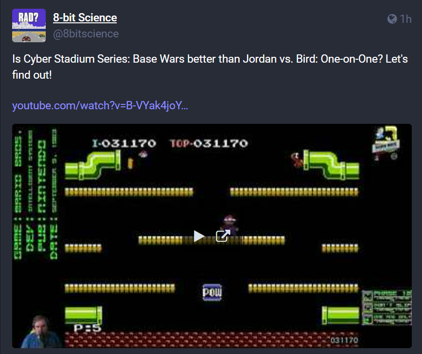

# Random-RankingTheNES

A PowerShell module and Mastodon bot that randomly selects a NES game that Jeff Gerstmann has ranked in his ongoing series "Ranking the NES".

Follow here: [@8bitscience@cheddarcrackers.club](https://cheddarcrackers.club/@8bitscience)

## Why?

Video game journalist Jeff Gerstmann has been doing some science and has taken it upon himself to rank every NES game. In a weekly video series aptly named "Ranking the NES", Jeff has created dozens of hours of video content with plenty of more still to come.

The science is something that I look forward to every Friday. Sometimes I put on an older episode as background noise. Selecting an episode on YouTube takes a few more extra clicks and scrolling than I would like so I wrote a PowerShell script that would select one for me and automatically open the link in a browser. I figured the logic of the script would also make a useful Mastodon bot so I created a PowerShell module out of this idea.

## How?

A fan of the video series has made the webiste [8bitnintendo.science](https://8bitnintendo.science/) which has a list of Jeff's rankings along with links to the exact moment each game appears. His site is hosted using GitHub Pages and is [open to contributions](https://github.com/vNakamura/8bitnintendo-science). The repo contains a CSV that contains the site's data which made setting up my bot a breeze.

I am also utilizing workflows from [this repo](https://github.com/adamdriscoll/pwsh-github-actions) showcasing how to utilize GitHub Actions with PowerShell scripts as a basis for running the bot.

## Example Local Command

Running `Invoke-RandomGame.ps1` will automatically open a browser to the randomly selected timestamp to a game from the CSV.

```
PS C:\Users\judog\Documents\git\Random-RankingTheNES> .\Invoke-RandomGame.ps1 

Is WWF Wrestlemania Challenge better than Super Pitfall? Let's find out! 

https://www.youtube.com/watch?v=DB3oO2x5Dzs&t=3825s
```

## Example Post

Running `Invoke-MastodonBot.ps1` will require Mastodon credentials. It will generate a post. I have used GitHub Actions to run this script daily at 3 PM.

